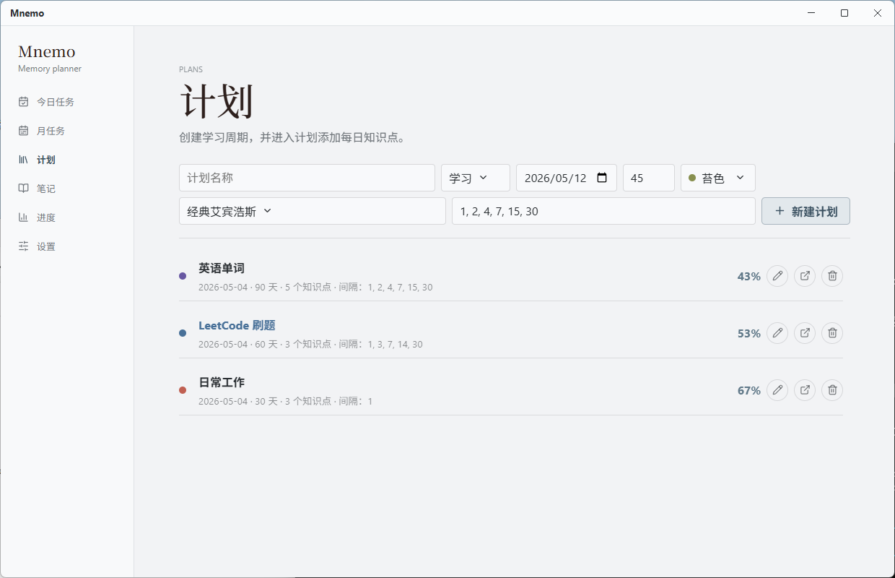
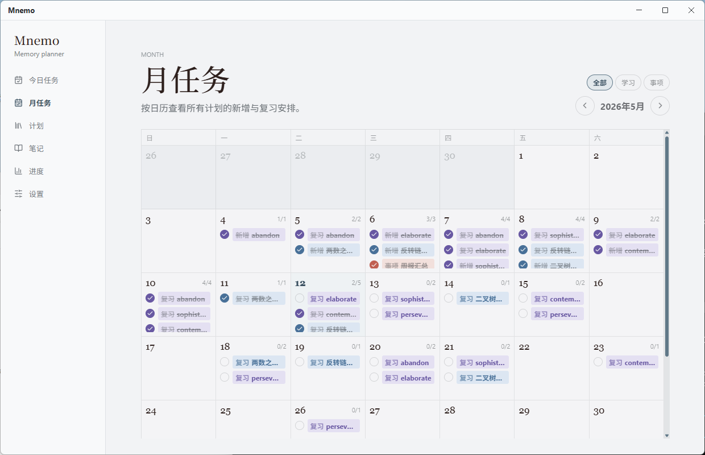
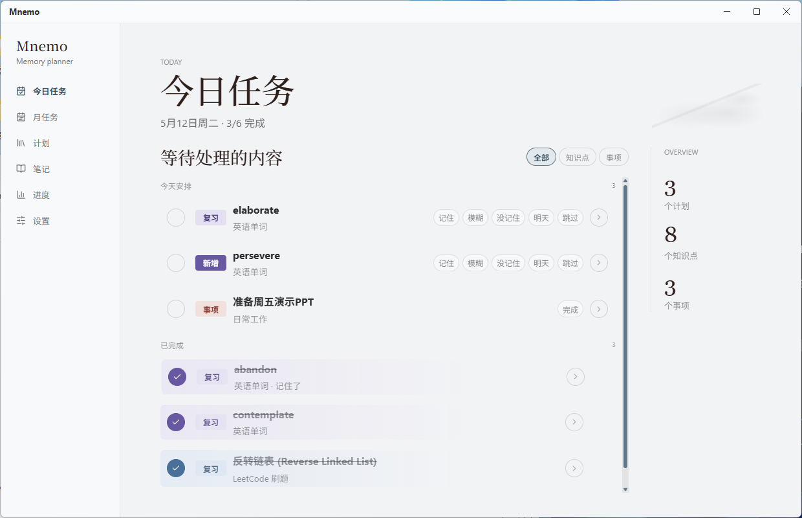
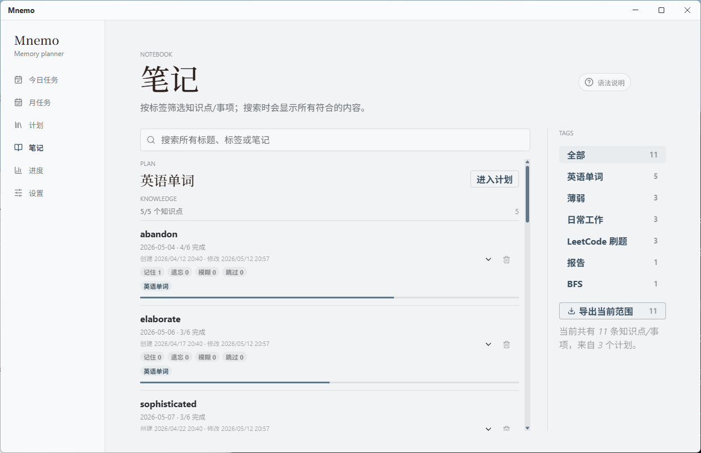
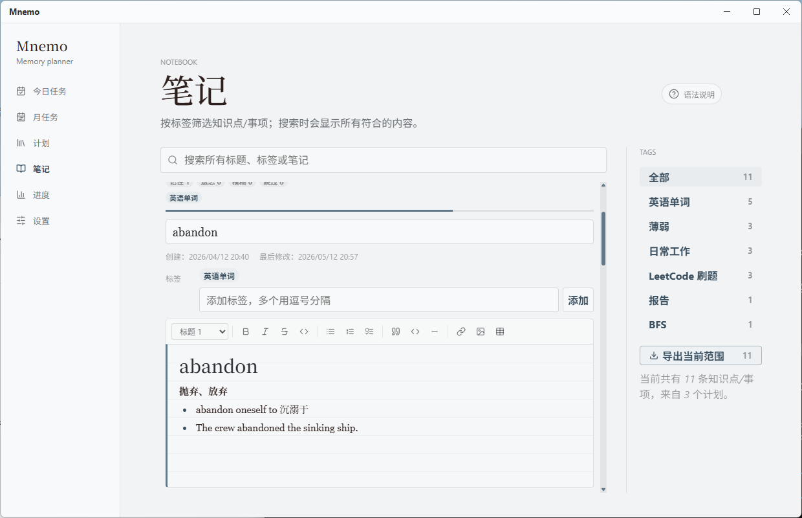
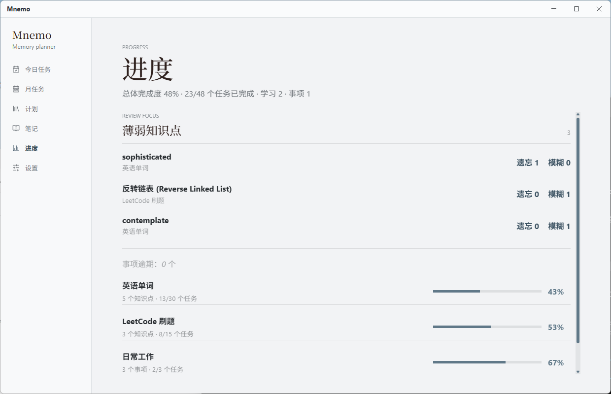
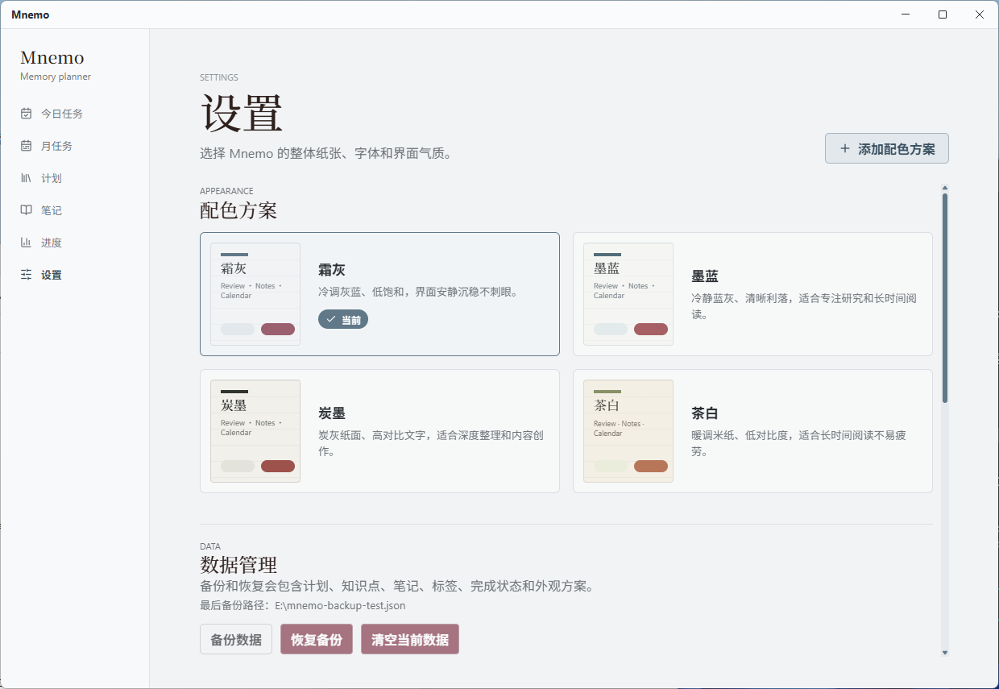
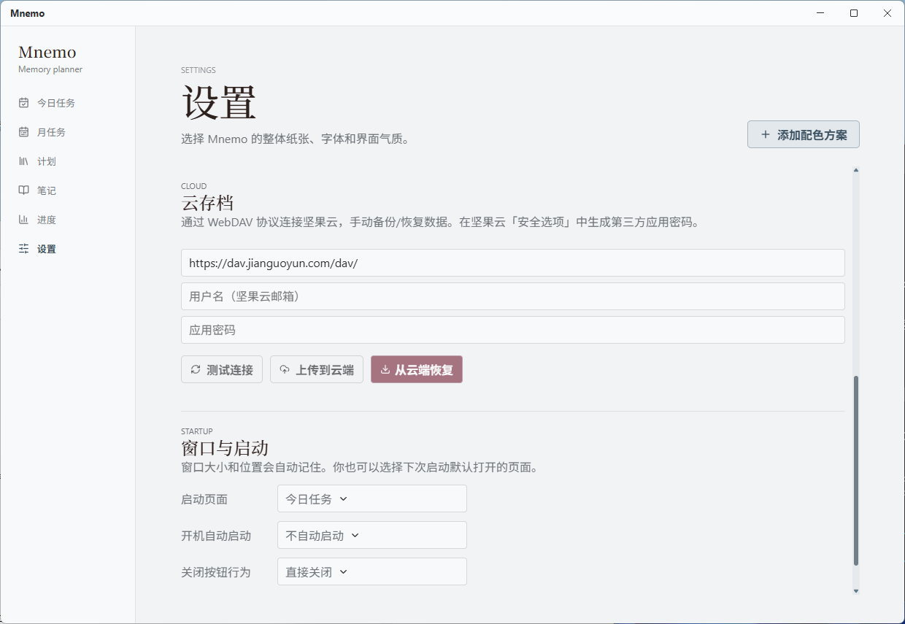

# Mnemo

本地优先的桌面间隔记忆规划器，基于艾宾浩斯遗忘曲线。Electron + React + TypeScript。

## 功能

- **计划管理** — 创建学习计划或事项计划，支持自定义起始日期、天数和复习间隔。内置经典艾宾浩斯（1/2/4/7/15/30 天）、密集冲刺（连续 6 天）、每日任务三种模板

<p align="center">
  
</p>

- **自动排程** — 添加知识点时按复习间隔自动生成排程，逾期任务顺延至今天，不丢失
- **月历视图** — 按日历浏览所有计划的新增与复习安排，支持按计划类型筛选

<p align="center">
  
</p>

- **今日任务** — 勾选完成，反馈记忆状态（记住/模糊/遗忘），一键延期或跳过。模糊和遗忘自动生成补救复习

<p align="center">
  
</p>

- **标签筛选** — 笔记页按标签组织和搜索，支持批量导出 Markdown（含图片）

<p align="center">
  
</p>

- **笔记系统** — 内置 Markdown 编辑器，支持 GFM 语法（标题、粗斜体、表格、代码块、任务列表、图片粘贴），可导出为 Markdown 文件

<p align="center">
  
</p>

- **薄弱追踪** — 遗忘或模糊的知识点自动标记“薄弱”，进度页集中查看和复习

<p align="center">
  
</p>

- **外观主题** — 霜灰、墨蓝、炭墨、茶白四套内置配色，支持自定义纸张、文字、强调色
- **云存档** — 支持 WebDAV 协议（坚果云）手动备份/恢复，上传前展示详细差异对比
- **数据备份** — JSON 格式导入/导出，含计划、知识点、笔记、完成状态和图片
- **系统托盘** — 最小化到托盘、开机自启

<p align="center">
  
</p>

<p align="center">
  
</p>

## 环境

```
Node.js ≥ 22
```

## 开发

```bash
npm install
npm run desktop        # Electron 开发模式（完整功能）
npm run dev            # 仅浏览器（无备份、云存档、托盘等 IPC 功能）
npm test               # 单元测试
```

## 打包

```bash
npm run pack           # 输出 NSIS 安装包到 release/
```

## 技术栈

Electron · React 19 · Vite · TypeScript · TipTap · Vitest

## 许可

[MIT](LICENSE) · 第三方依赖见 [ACKNOWLEDGMENTS.md](ACKNOWLEDGMENTS.md)
